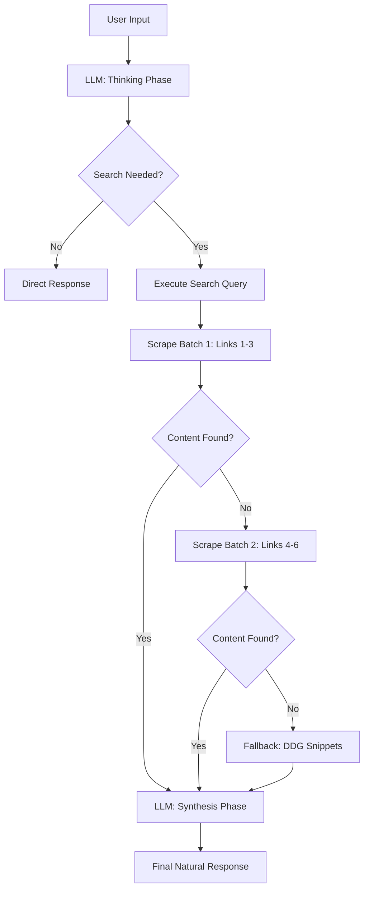

# 🌐 WebConnect AI: The Real-Time Insight Engine

> **Bridge the gap between your AI and the live web. Provide online web custom search to your AI with zero API costs.**

WebConnect AI is an advanced, autonomous searching agent designed to give Large Language Models (LLMs) immediate access to the internet. Built on a high-performance "Think-Synthesize" pipeline, it transforms static AI into a dynamic knowledge engine capable of browsing, scraping, and synthesizing live web data.

[](https://fastapi.tiangolo.com/)
[](https://build.nvidia.com/)
[](https://duckduckgo.com/)
[](https://github.com/Dhairya0707/WebConnect-AI)

---

## ✨ Why WebConnect AI?

*   **🚀 Live Web Retrieval**: Seamlessly connect your AI to real-time information, breaking free from training data cutoff dates.
*   **💸 Zero API Costs**: Unlike traditional RAG systems that require expensive Bing, Google, or Serper subscriptions, WebConnect uses intelligent HTML scraping.
*   **🧠 Thinking-First Architecture**: The agent first analyzes the query to decide *if* and *how* to search, ensuring high-quality context.
*   **🧼 Clean Context Synthesis**: Advanced scraping heuristics strip away ads, navigation, and noise, feeding only high-signal content to your LLM.
*   **🏗️ Production-Ready Workbench**: A sleek, minimal interface designed for professional search workflows.

---

## 🛠️ How It Works (The Pipeline)

WebConnect AI operates on a tiered reliability workflow to ensure the best possible answer is delivered every time.



---

## ⚙️ Quick Start

### 1. Prerequisites
- Python 3.9+ 🐍
- NVIDIA API Key ([Get it here for free](https://build.nvidia.com/mistralai/mistral-small))

### 2. Installation
```bash
# Clone the repository
git clone https://github.com/Dhairya0707/WebConnect-AI.git
cd webconnect-ai

# Setup virtual environment
python -m venv venv
source venv/bin/activate  # Windows: venv\Scripts\activate

# Install dependencies
pip install -r requirements.txt
```

### 3. Configuration
Copy the template `.env.example` to `.env` and add your API key:
```bash
cp .env.example .env
```
Edit `.env`:
```text
NVIDIA_API_KEY=your-nvapi-key-here
```

### 4. Launch
```bash
python main.py
```
Visit **`http://localhost:8000`** to start searching.

---

## 🚂 Railway Deployment Guide

Deploying WebConnect AI to Railway is simple and takes less than 2 minutes.

### 1. Connect Repository
- Go to [Railway.app](https://railway.app/).
- Click **"New Project"** -> **"Deploy from GitHub repo"**.
- Select the `Dhairya0707/WebConnect-AI` repository.

### 2. Configure Variables
Railway will automatically detect the `requirements.txt` and `Procfile`. However, you must add your API key:
- Click on your project in Railway.
- Go to the **Variables** tab.
- Add `NVIDIA_API_KEY`: `your-nvapi-key-here`.

### 3. Exposing the App
- Go to the **Settings** tab of your service.
- Click **"Generate Domain"** to get a public URL for your search engine.
- Railway will handle the `PORT` automatically thanks to the updated `main.py`.

---

## 📂 Project Anatomy

- **`api.py`**: High-performance FastAPI backend.
- **`llm_agent.py`**: The "Thinking" core and tool-calling logic.
- **`search_engine.py`**: Stealth DuckDuckGo scraper (Zero cost).
- **`scraper.py`**: Concurrent web content extractor with heuristic noise reduction.
- **`index.html`**: A modern, responsive dashboard for search exploration.

---

## ⚠️ Important Limitations

While WebConnect AI is powerful, it has certain technical constraints inherent to web scraping and RAG workflows:

1.  **Scraping Reliability**: Some websites use advanced anti-bot measures (like Cloudflare or CAPTCHAs). If a page is blocked, the system automatically retries with alternate sources or falls back to search snippets.
2.  **Latency**: Because the agent performs multiple steps (Thinking -> Searching -> Scraping -> Synthesis), responses may take 10-20 seconds for complex queries.
3.  **Context Window**: Extremely long web pages are truncated to 20,000 characters to fit within the LLM's context limit while maintaining reasoning speed.
4.  **JavaScript Rendering**: The current scraper does not execute JavaScript. Content hidden behind client-side rendering (SPA sites) may not be fully retrieved.
5.  **Rate Limits**: The system is subject to the rate limits of the NVIDIA API and the tolerance of search engines like DuckDuckGo.

---

## 🤝 Contributing

Contributions are welcome! If you have ideas for better scraping heuristics or UI improvements, please open an issue or submit a pull request.

---

*Handcrafted for the Developer Community by [Dhairya Darji](https://github.com/Dhairya0707)*
